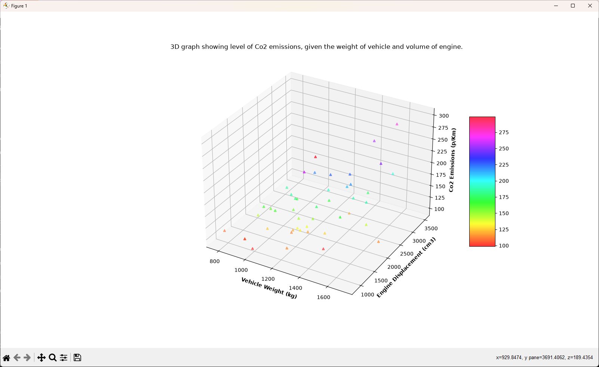

# CO₂ Emissions Machine Learning Exercise

A machine learning exercise completed during my Level 3 Computing studies, exploring multiple linear regression using Python, pandas and scikit-learn to predict vehicle CO₂ emissions.

This project was based on the W3Schools Machine Learning tutorials and has been retained as part of my development portfolio to demonstrate my early practical experience with machine learning, data preparation and regression.

The source has intentionally not been substantially rewritten to reflect my current programming ability. A minor portability update was made using Python's `pathlib` standard library so that the dataset can be located reliably regardless of the current working directory. Otherwise, the repository preserves the original coursework implementation.


## Project Overview

The exercise uses vehicle data to investigate the relationship between:

- Vehicle weight
- Engine volume
- CO₂ emissions

A multiple linear regression model is trained using vehicle weight and engine volume as input features, with CO₂ emissions used as the target value.

The project also uses Matplotlib to visualise the dataset and help explore the relationship between the variables.


## My Contribution

The original machine learning implementation was based on the W3Schools Machine Learning learning material and is not presented as an independently developed machine learning model.

While working through the exercise, I noticed that some of the vehicle specifications within the supplied dataset did not accurately correspond with their real-world counterparts.

As part of my coursework, I:

- Investigated inconsistencies within the supplied vehicle dataset.
- Researched vehicle specifications to compare them with the supplied data.
- Corrected vehicle weights and engine capacities where appropriate.
- Added additional vehicle records to expand the dataset for testing.
- Used the revised dataset with the regression model to investigate its predictions.
- Experimented with data scaling and visualisation while learning how the model operated.

This became a useful exercise not only in machine learning fundamentals, but also in questioning the quality of source data before relying on it for analysis.


## Technologies Used

- Python
- pandas
- NumPy
- scikit-learn
- Matplotlib


## Machine Learning Concepts

The exercise introduced me to several fundamental machine learning and data-analysis concepts:

- Multiple linear regression
- Features and target variables
- Model fitting
- Prediction
- Regression coefficients
- Data preparation
- Feature scaling
- Data visualisation


## Dataset

The dataset contains vehicle information including:

- Manufacturer
- Model
- Engine volume
- Vehicle weight
- CO₂ emissions

The original dataset was supplied as part of the W3Schools learning exercise.

During my work on the project, I revised a number of vehicle specifications and added additional records for testing purposes.

The modified dataset is included in this repository as `data.csv`.


## Dataset Modifications

The original dataset used by the W3Schools exercise contained 36 vehicle records.
While working through the exercise, I noticed that a number of the supplied vehicle specifications did not accurately correspond with their real-world counterparts. I therefore reviewed all 36 original entries and researched the vehicle specifications, correcting values such as vehicle weight, engine capacity and CO₂ emissions where necessary.
During this process, I also corrected a manufacturer spelling error in the original dataset (`Hundai` -> `Hyundai`).
After reviewing the original dataset, I added a further 10 vehicles with researched specifications to provide additional data for testing. This expanded the dataset from 36 to 46 vehicle records.
The structure and original 36-vehicle dataset originate from the W3Schools learning exercise. The review and correction of those records, along with the 10 additional vehicle entries, were completed as part of my coursework.


## Running the Project

The script locates `data.csv` relative to the Python file using pathlib, allowing the project to run without requiring the terminal's working directory to be manually set.

### Requirements

The project requires Python and the following packages:

```text
pandas
numpy
scikit-learn
matplotlib
```

Install the required packages using:

```bash
pip install pandas numpy scikit-learn matplotlib
```

Then run the project:

```bash
python W3S-Task.py
```

## Attribution

This project was developed as a learning exercise using machine learning tutorials and example code provided by W3Schools.

The underlying multiple linear regression implementation is therefore not presented as my own original implementation.

My contribution focused primarily on investigating the supplied vehicle dataset, researching inconsistencies, correcting vehicle specifications, adding additional test data, and experimenting with the resulting model.


## W3Schools Learning Material

- [W3Schools Multiple Regression](https://www.w3schools.com/python/python_ml_multiple_regression.asp)
- [W3Schools Scale](https://www.w3schools.com/python/python_ml_scale.asp)


## Project Background

This exercise was originally completed during my Level 3 Computing studies in 2024.

It represents an early stage of my Python and machine learning development and has been retained as part of my portfolio to demonstrate my progression and foundational exposure to machine learning.

The original implementation has intentionally been preserved rather than rewritten to reflect my current programming ability. The only later change is a minor `pathlib` portability update to make locating the dataset more reliable.


## What I Learned

This exercise provided my first practical exposure to applying machine learning techniques using Python.

A particularly useful lesson was the importance of data quality. While working with the supplied dataset, I identified vehicle specifications that appeared inconsistent with their real-world counterparts. Investigating and correcting these values demonstrated that the usefulness of a model depends heavily on the quality of the data supplied to it.

The exercise also introduced me to:

- Preparing features and target variables for a model.
- Training and using a multiple linear regression model.
- Interpreting regression coefficients and predictions.
- Using pandas and NumPy for data handling.
- Using Matplotlib to explore data visually.
- Experimenting with feature scaling.

## Example Output

